# Paper
by Ramesh, Alexandra and Gino  
October 16, 2016  


## Overview

The purpose of this project is to download,read in building sales of borough manhatten and examine the sales data set. To further understand the data we split the data into building that we are going to perform our analysis ex. Family and Condos   

## Family   

Here was extracted builidings that are 1,2,3 bedroom family homes, we cleaned up the data to perform analysis on columns that have gross square feet, land square feet and price data avialble.

* Below is the dimensions and a summary of the data set


```r
dim(mn.homes)
```

```
## [1] 219  27
```

```r
str(mn.homes)
```

```
## 'data.frame':	219 obs. of  27 variables:
##  $ borough                       : int  1 1 1 1 1 1 1 1 1 1 ...
##  $ neighborhood                  : Factor w/ 39 levels "ALPHABET CITY            ",..: 1 2 2 2 2 2 5 6 6 6 ...
##  $ building.class.category       : Factor w/ 41 levels "01  ONE FAMILY DWELLINGS                    ",..: 3 1 1 2 2 3 2 2 2 3 ...
##  $ tax.class.at.present          : Factor w/ 9 levels "  ","1","1A",..: 2 2 2 2 2 2 2 2 2 2 ...
##  $ block                         : int  376 722 771 742 745 719 1053 445 449 448 ...
##  $ lot                           : int  24 10 52 19 11 58 55 1 10 46 ...
##  $ ease.ment                     : logi  NA NA NA NA NA NA ...
##  $ building.class.at.present     : Factor w/ 122 levels "  ","A1","A4",..: 11 3 6 10 3 11 105 105 105 11 ...
##  $ address                       : Factor w/ 11614 levels "1000 AVENUE OF THE AMER                  ",..: 5389 8910 4272 6978 7472 8596 8861 9878 8506 6576 ...
##  $ apartment.number              : Factor w/ 2686 levels "            ",..: 1 1 1 1 1 1 1 1 1 1 ...
##  $ zip.code                      : int  10009 10011 10011 10011 10011 10011 10036 10003 10003 10003 ...
##  $ residential.units             : int  3 1 1 2 1 3 2 2 2 3 ...
##  $ commercial.units              : int  0 0 0 0 0 0 1 1 1 0 ...
##  $ total.units                   : int  3 1 1 2 1 3 3 3 3 3 ...
##  $ land.square.feet              : Factor w/ 1027 levels " -   "," 100 ",..: 405 403 379 423 409 316 342 160 908 252 ...
##  $ gross.square.feet             : Factor w/ 1457 levels " -   "," 1,000 ",..: 715 642 754 887 1078 658 693 1074 637 917 ...
##  $ year.built                    : num  1900 1910 1901 1910 1910 ...
##  $ tax.class.at.time.of.sale     : int  1 1 1 1 1 1 1 1 1 1 ...
##  $ building.class.at.time.of.sale: Factor w/ 121 levels "A1","A4","A5",..: 10 2 5 9 6 10 104 104 104 10 ...
##  $ sale.price                    : Factor w/ 6787 levels " -   "," 1 ",..: 3372 694 6279 4972 261 5601 4049 5374 3075 5853 ...
##  $ sale.date                     : Factor w/ 350 levels "10/10/2015","10/11/2015",..: 15 301 75 144 350 319 91 138 20 234 ...
##  $ sale.price.n                  : num  3775000 13000000 8800000 6109000 11095675 ...
##  $ gross.sqft                    : num  3696 3360 3855 4554 5808 ...
##  $ land.sqft                     : num  2059 2057 1975 2147 2074 ...
##  $ Price.per.gross.sqft          : num  1021 3869 2283 1341 1910 ...
##  $ Price.per.land.sqft           : num  1833 6320 4456 2845 5350 ...
##  $ outliers                      : num  0 0 0 0 0 0 0 0 0 0 ...
```

* 5 Number summary on Sales Price, Gross Square Feet and Land Square Feet

```r
summary(mn.homes$sale.price.n)
```

```
##     Min.  1st Qu.   Median     Mean  3rd Qu.     Max. 
##   250000  2100000  4300000  6028000  7960000 32000000
```

```r
summary(mn.homes$gross.sqft)
```

```
##    Min. 1st Qu.  Median    Mean 3rd Qu.    Max. 
##     924    3030    3696    3886    4480    8745
```

```r
summary(mn.homes$land.sqft)
```

```
##    Min. 1st Qu.  Median    Mean 3rd Qu.    Max. 
##     353    1499    1699    1718    1939    7373
```

## Histogram of Home Sale Price, Gross Square Feet and Land Square Feet


```r
hist(log10(mn.homes$sale.price.n), main="Histogram of Home Sale Price", xlab="Log of Sales Price ")
```

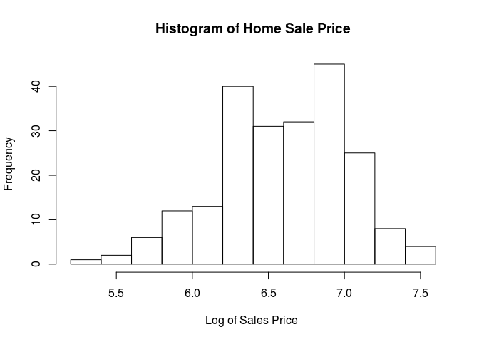<!-- -->

```r
hist(log10(mn.homes$gross.sqft), main="Histogram of Home Gross Sqft", xlab="Log of Gross sqft ")
```

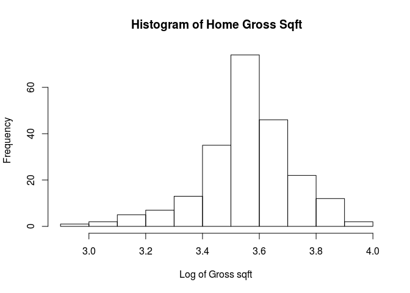<!-- -->

```r
hist(log10(mn.homes$land.sqft), main="Histogram of Home Land Sqft", xlab="Log of Land sqft ")
```

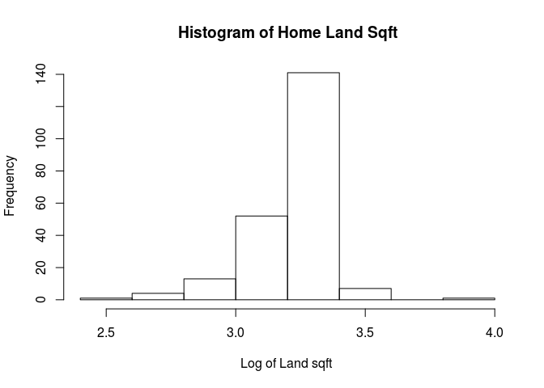<!-- -->
        
From the histograms we can see that the log data sets are normally distributed for Sales price and Gross square feet, however the land square feet data is not normally distributed.       

## 5 number summary on Home price per gross square feet and Home price per land square feet

```r
summary(mn.homes$Price.per.gross.sqft)
```

```
##    Min. 1st Qu.  Median    Mean 3rd Qu.    Max. 
##    73.1   619.2  1237.0  1480.0  2017.0  5624.0
```

```r
summary(mn.homes$Price.per.land.sqft)
```

```
##     Min.  1st Qu.   Median     Mean  3rd Qu.     Max. 
##    88.16  1225.00  3085.00  3615.00  5063.00 13870.00
```

## Sale Price vs Gross Square feet 


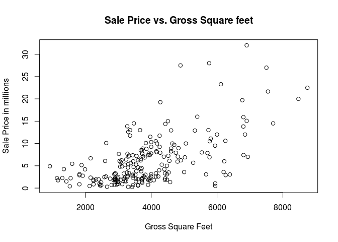<!-- -->
              
              
Note: From the above graph, we can see that most of the data points occur between 2000 Gross squarefeet and 5000 Gross squarefeet


## Sale Price vs Land Square feet 


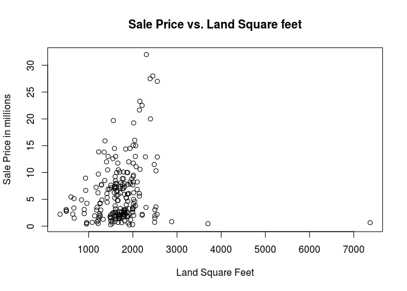<!-- -->

Note: From the plot, it makes sense, houses with a backyard is limited in Manhattan, mostly between 1000 to 4000 sqft.

## Condos  

Here was extracted builidings that are Condos, we cleaned up the data to perform analysis on columns that have gross square feet, land square feet and price data avialble. However condos data set did not have information on gross square feet and land square feet therefore they where excluded from our analysis

* Below is the dimensions and a summary of the data set


```r
dim(mn.condos)
```

```
## [1] 5380   25
```

```r
str(mn.condos)
```

```
## 'data.frame':	5380 obs. of  25 variables:
##  $ borough                       : int  1 1 1 1 1 1 1 1 1 1 ...
##  $ neighborhood                  : Factor w/ 39 levels "ALPHABET CITY            ",..: 1 1 1 1 1 1 1 1 1 1 ...
##  $ building.class.category       : Factor w/ 41 levels "01  ONE FAMILY DWELLINGS                    ",..: 11 11 11 11 11 11 11 11 11 11 ...
##  $ tax.class.at.present          : Factor w/ 9 levels "  ","1","1A",..: 5 5 5 5 5 5 5 5 5 5 ...
##  $ block                         : int  373 373 384 392 392 392 392 394 394 394 ...
##  $ lot                           : int  1002 1010 1224 1019 1075 1085 1122 1503 1504 1505 ...
##  $ ease.ment                     : logi  NA NA NA NA NA NA ...
##  $ building.class.at.present     : Factor w/ 122 levels "  ","A1","A4",..: 87 87 87 87 87 87 87 87 87 87 ...
##  $ address                       : Factor w/ 11614 levels "1000 AVENUE OF THE AMER                  ",..: 6785 6785 6315 1718 1718 1718 10461 3067 3067 3067 ...
##  $ apartment.number              : Factor w/ 2686 levels "            ",..: 922 1668 2290 1560 233 2277 1560 922 929 932 ...
##  $ zip.code                      : int  10009 10009 10002 10009 10009 10009 10009 10009 10009 10009 ...
##  $ residential.units             : int  1 1 1 1 1 1 1 1 1 1 ...
##  $ commercial.units              : int  0 0 0 0 0 0 0 0 0 0 ...
##  $ total.units                   : int  1 1 1 1 1 1 1 1 1 1 ...
##  $ land.square.feet              : Factor w/ 1027 levels " -   "," 100 ",..: 1 1 1 1 1 1 1 1 1 1 ...
##  $ gross.square.feet             : Factor w/ 1457 levels " -   "," 1,000 ",..: 1 1 1 1 1 1 1 1 1 1 ...
##  $ year.built                    : num  1920 1920 2005 1928 1928 ...
##  $ tax.class.at.time.of.sale     : int  2 2 2 2 2 2 2 2 2 2 ...
##  $ building.class.at.time.of.sale: Factor w/ 121 levels "A1","A4","A5",..: 86 86 86 86 86 86 86 86 86 86 ...
##  $ sale.price                    : Factor w/ 6787 levels " -   "," 1 ",..: 856 5860 6478 1475 6501 2065 961 4607 6051 5341 ...
##  $ sale.date                     : Factor w/ 350 levels "10/10/2015","10/11/2015",..: 287 287 320 156 92 327 157 201 196 216 ...
##  $ sale.price.n                  : num  1395796 792812 925000 1750000 931000 ...
##  $ gross.sqft                    : num  NA NA NA NA NA NA NA NA NA NA ...
##  $ land.sqft                     : num  NA NA NA NA NA NA NA NA NA NA ...
##  $ outliers                      : num  0 0 0 0 0 0 0 0 0 0 ...
```

* 5 Number summary on Sales Price

```r
summary(mn.condos$sale.price.n)
```

```
##      Min.   1st Qu.    Median      Mean   3rd Qu.      Max. 
##    101000    965000   1700000   2939000   3200000 260800000
```

## Histogram of Condo Sale Price


```r
hist(log10(mn.condos$sale.price.n), main="Histogram of Condo Sale Price", xlab="Log of Sales Price ")
```

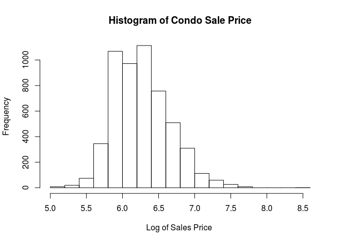<!-- -->


## Rentals 

Here was extracted builidings that are Rentals, we cleaned up the data to perform analysis on columns that have gross square feet, land square feet and price data avialble. 

* Below is the dimensions and a summary of the data set


```r
dim(mn.rentals)
```

```
## [1] 647  27
```

```r
str(mn.rentals)
```

```
## 'data.frame':	647 obs. of  27 variables:
##  $ borough                       : int  1 1 1 1 1 1 1 1 1 1 ...
##  $ neighborhood                  : Factor w/ 39 levels "ALPHABET CITY            ",..: 1 1 1 1 1 1 1 1 1 1 ...
##  $ building.class.category       : Factor w/ 41 levels "01  ONE FAMILY DWELLINGS                    ",..: 5 5 5 5 5 5 5 5 5 5 ...
##  $ tax.class.at.present          : Factor w/ 9 levels "  ","1","1A",..: 7 5 5 7 5 5 7 7 5 5 ...
##  $ block                         : int  373 377 387 389 398 399 401 404 405 405 ...
##  $ lot                           : int  16 2 119 53 43 39 27 41 13 15 ...
##  $ ease.ment                     : logi  NA NA NA NA NA NA ...
##  $ building.class.at.present     : Factor w/ 122 levels "  ","A1","A4",..: 12 18 18 12 18 18 15 15 18 15 ...
##  $ address                       : Factor w/ 11614 levels "1000 AVENUE OF THE AMER                  ",..: 6848 614 10420 10351 3090 3126 9813 6880 9499 9529 ...
##  $ apartment.number              : Factor w/ 2686 levels "            ",..: 1 1 1 1 1 1 1 1 1 1 ...
##  $ zip.code                      : int  10009 10009 10009 10009 10009 10009 10009 10009 10009 10009 ...
##  $ residential.units             : int  10 22 22 10 28 16 8 10 20 20 ...
##  $ commercial.units              : int  0 3 2 0 4 1 1 0 2 0 ...
##  $ total.units                   : int  10 25 24 10 32 17 9 10 22 20 ...
##  $ land.square.feet              : Factor w/ 1027 levels " -   "," 100 ",..: 447 791 676 467 833 451 348 488 564 564 ...
##  $ gross.square.feet             : Factor w/ 1457 levels " -   "," 1,000 ",..: 1344 342 157 1279 370 1277 1095 1218 8 1432 ...
##  $ year.built                    : num  1899 1900 1920 1939 1900 ...
##  $ tax.class.at.time.of.sale     : int  2 2 2 2 2 2 2 2 2 2 ...
##  $ building.class.at.time.of.sale: Factor w/ 121 levels "A1","A4","A5",..: 11 17 17 11 17 17 14 14 17 14 ...
##  $ sale.price                    : Factor w/ 6787 levels " -   "," 1 ",..: 1844 1347 289 5122 1394 5103 4674 318 4376 5515 ...
##  $ sale.date                     : Factor w/ 350 levels "10/10/2015","10/11/2015",..: 42 321 112 193 14 317 193 252 321 321 ...
##  $ sale.price.n                  : num  20000000 16700000 11250000 6350000 17000000 ...
##  $ gross.sqft                    : num  8625 19830 13546 7860 20994 ...
##  $ land.sqft                     : num  2204 4510 3445 2271 5088 ...
##  $ Price.per.gross.sqft          : num  2319 842 831 808 810 ...
##  $ Price.per.land.sqft           : num  9074 3703 3266 2796 3341 ...
##  $ outliers                      : num  0 0 0 0 0 0 0 0 0 0 ...
```

* 5 Number summary on Sales Price, Gross Square Feet and Land Square Feet

```r
summary(mn.rentals$sale.price.n/10000)
```

```
##     Min.  1st Qu.   Median     Mean  3rd Qu.     Max. 
##     18.1    403.8    710.0   2187.0   1270.0 411100.0
```

```r
summary(mn.rentals$gross.sqft)
```

```
##    Min. 1st Qu.  Median    Mean 3rd Qu.    Max. 
##    1850    6033    9695   40300   19180 8942000
```

```r
summary(mn.rentals$land.sqft)
```

```
##    Min. 1st Qu.  Median    Mean 3rd Qu.    Max.    NA's 
##     641    2000    2510   10280    4748 2675000       5
```

## Histogram of Home Sale Price, Gross Square Feet and Land Square Feet


```r
hist(log10(mn.rentals$sale.price.n), main="Histogram of Rental property Sale Price", xlab="Log of Sales Price ")
```

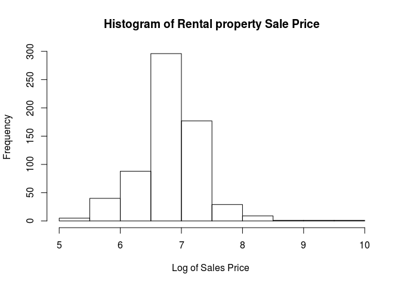<!-- -->

```r
hist(log10(mn.rentals$gross.sqft), main="Histogram of Rental property Gross Sqft", xlab="Log of Gross sqft ")
```

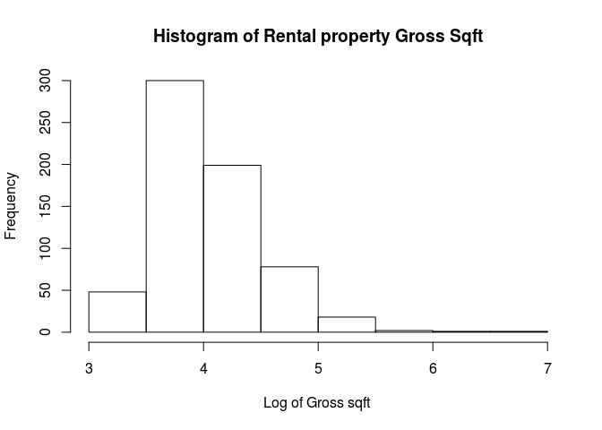<!-- -->

```r
hist(log10(mn.rentals$land.sqft), main="Histogram of Rental property Land Sqft", xlab="Log of Land sqft ")
```

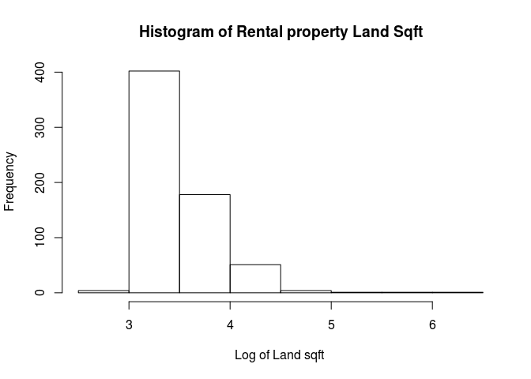<!-- -->
    

From the histograms we can see that the log data sets are normally distributed for Sales price, however the and Gross square feet and land square feet data is skewed to the right.


## 5 number summary on Home price per gross square feet and Home price per land square feet

```r
summary(mn.rentals$Price.per.gross.sqft)
```

```
##    Min. 1st Qu.  Median    Mean 3rd Qu.    Max. 
##   10.46  355.00  655.00  836.00 1030.00 8796.00
```

```r
summary(mn.rentals$Price.per.land.sqft)
```

```
##    Min. 1st Qu.  Median    Mean 3rd Qu.    Max. 
##       0    1212    2250    3045    3919   28910
```


## Log of Rental Price vs Log of Gross Square Feet

```r
plot(log10(mn.rentals$gross.sqft), log10(mn.rentals$sale.price.n), xlim = c(3,7), ylab = "Log of Sales price", xlab = "Log of gross sqft", main = "Rental Price vs Gross Square feet")
```

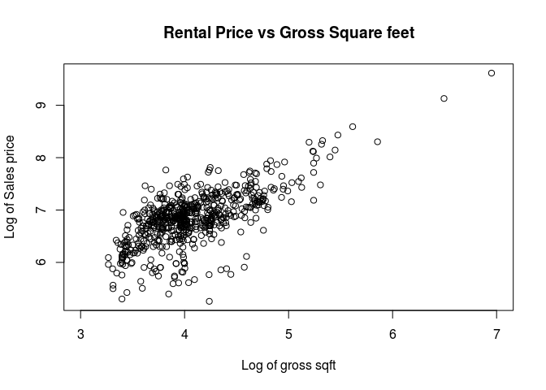<!-- -->

## Log of Rental Price vs Log of Land Square Feet

```r
plot(log10(mn.rentals$land.sqft), log10(mn.rentals$sale.price.n), ylab = "Log of Sales price", xlab = "Log of land sqft", main = "Rental Price vs Land Square feet")
```

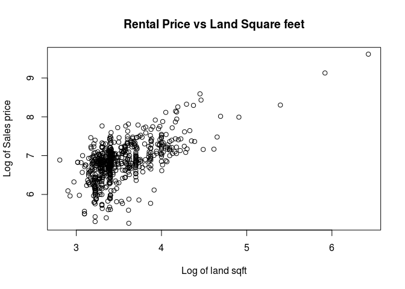<!-- -->

Note:         
The Manhattan data analysis exercise provided a good understanding into basic capability of R to perform data cleaning, creating tidy data, and data analysis of various data points for meaningful insights. The Manhattan data set included various real estate class such as FAMILY, RENTAL, CONDOS, and much more, and the asset sizes in square footages, sale prices, and other demographic information. In this exercise, we have performed some basic analysis of selective classes of FAMILY, RENTAL and CONDOS in correlation with size and sale prices as below.   
 
For building class “FAMILY”:       

* We have observed strong correlation between sale price and gross square feet between 2000 and 5000 square foot homes – higher the square footage and higher the sale price. The mean square footage was 3886. However, there is no conclusive evidence of very strong correlation for the houses beyond 5000 square foot – this will require a more in depth analysis on condition of the home, year of sale and other variables.          
* The histogram and summary functions on square footage shows 2/3rds of houses are within 2000 and 5000 square foot.          
* The histogram and summary functions on sale prices shows 2/3rds of the houses are between $2M and $8M, with a mean of $6028000        
* The histogram on sale price per gross square foot shows, 80% homes are <$2000 sq.ft      


Similar conclusion can be drawn with RENTAL and CONDOS.
